## 0. Responsive Web Design

Basic HTML and HTML5

Basic CSS

Applied Visual Design

Applied Accessibility

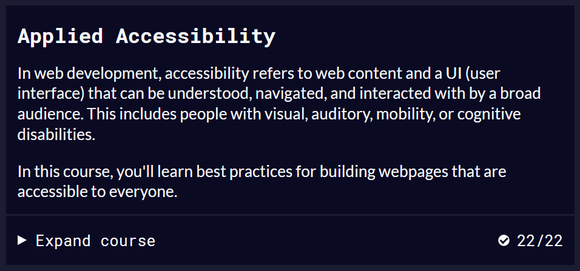

Responsive Web Design Principles

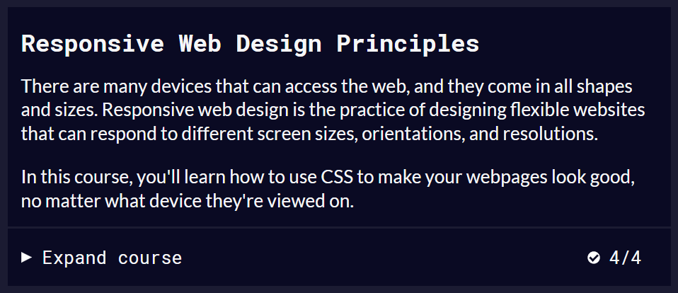

CSS Flexbox

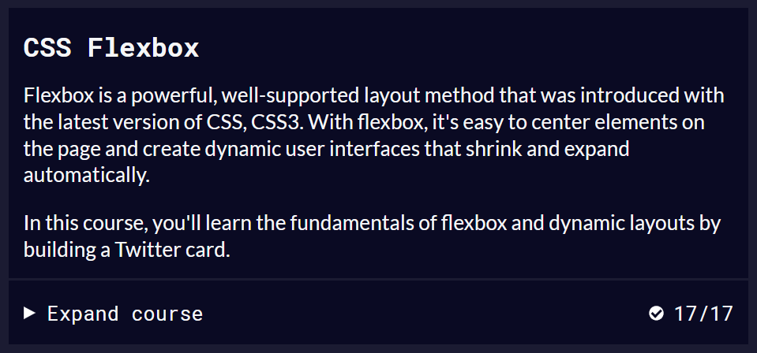

CSS Grid

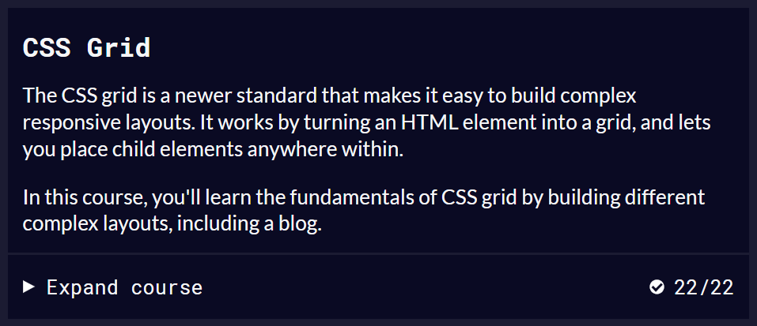

Responsive Web Design Projects

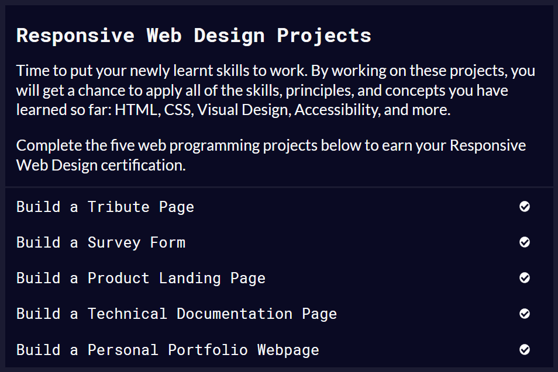

>

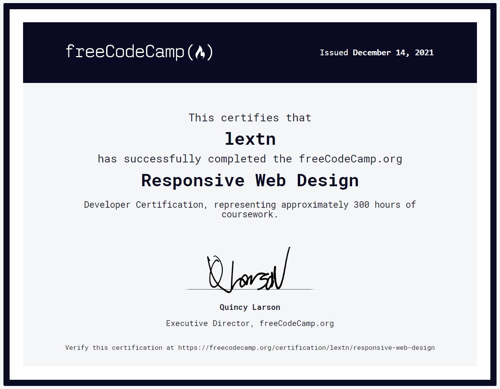

## 1. JavaScript Algorithms and Data Structures

Basic JavaScript

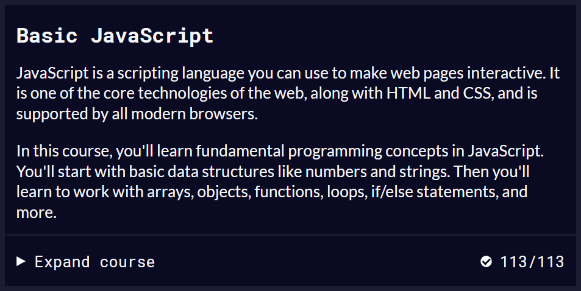

ES6

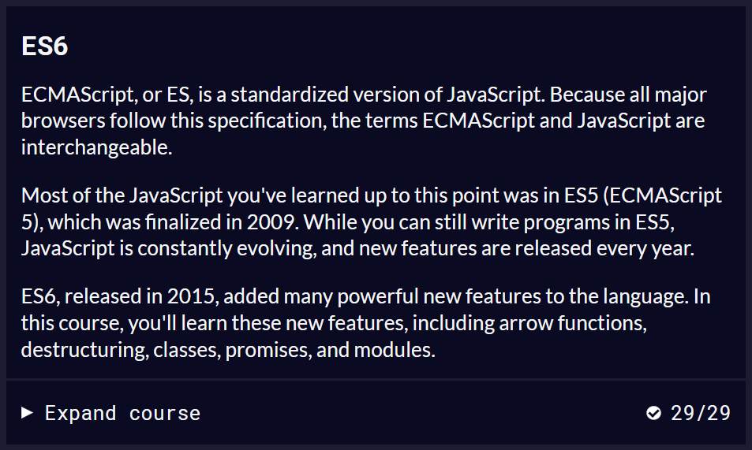

Regular Expressions

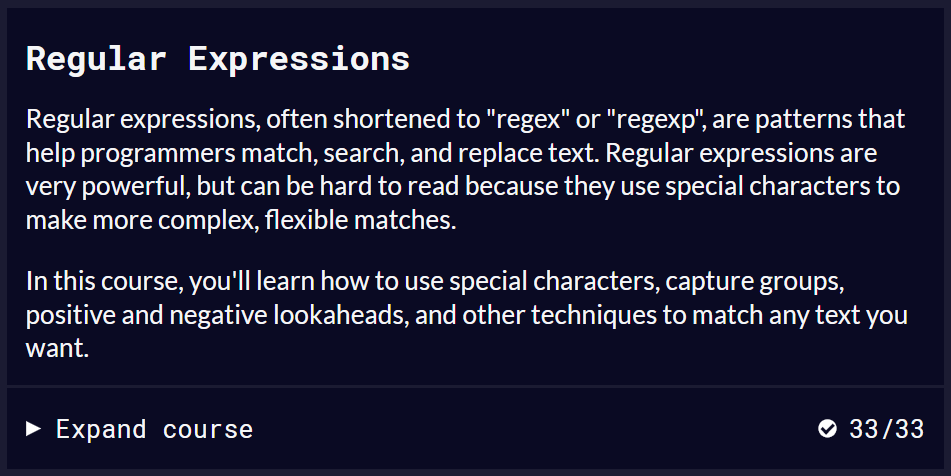

Debugging

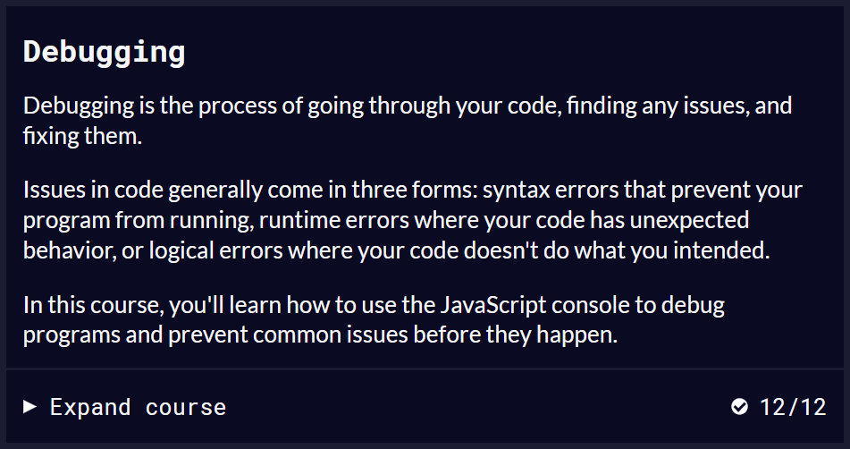

Basic Data Structures

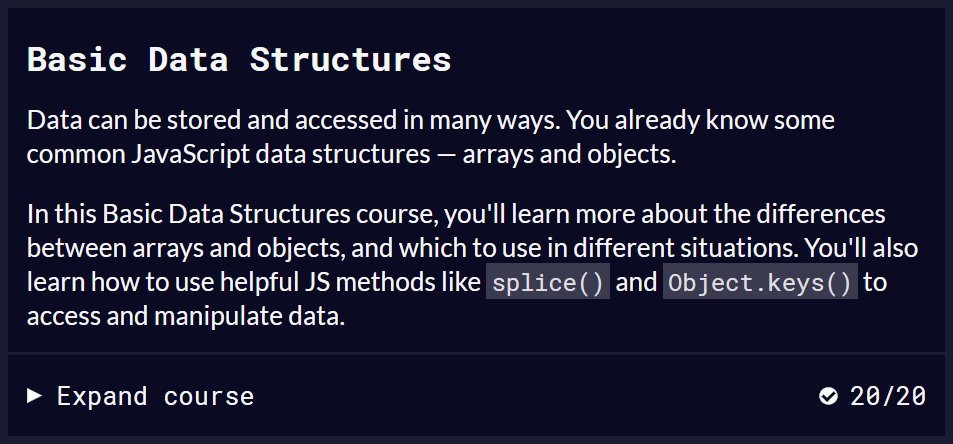

Basic Algorithm Scripting

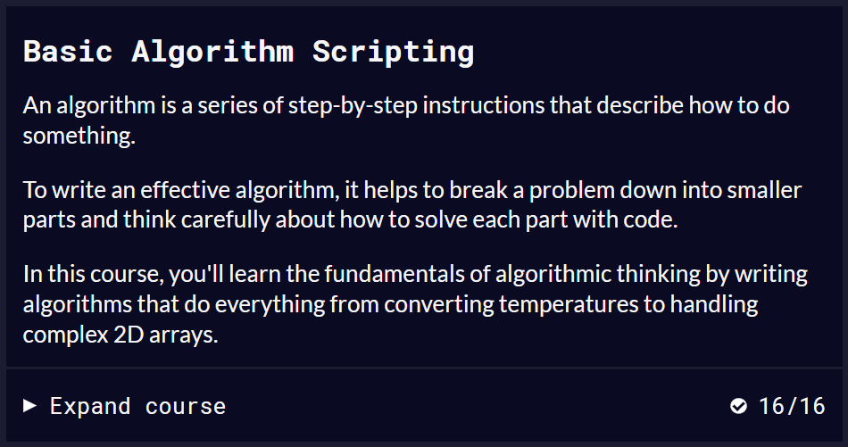

Object Oriented Programming

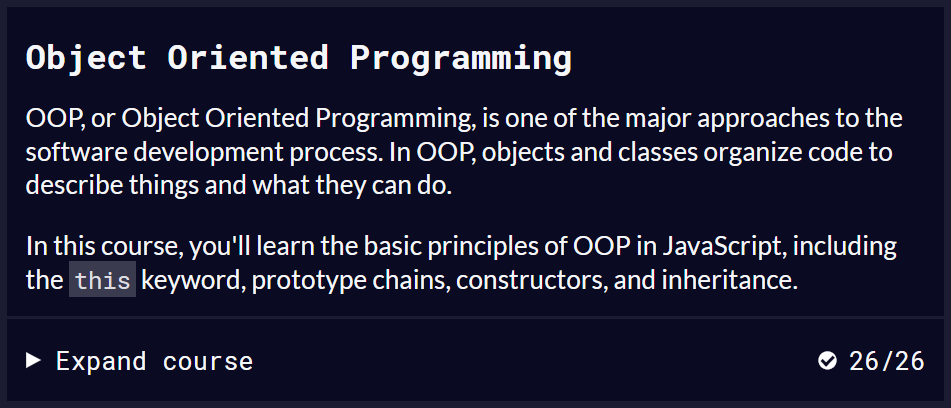

Functional Programming

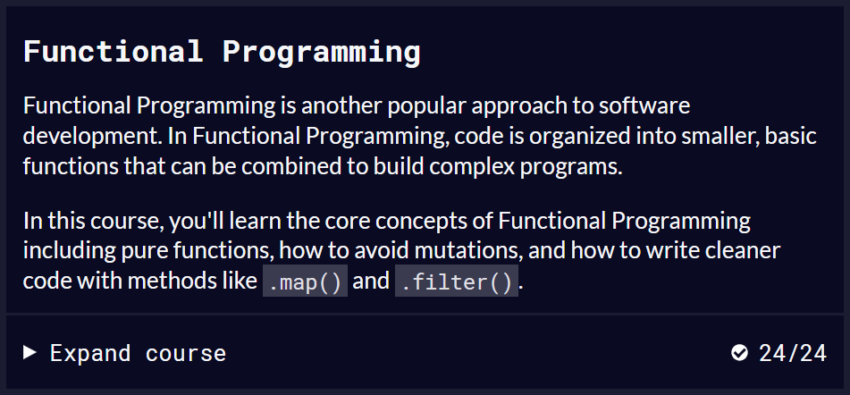

Intermediate Algorithm Scripting

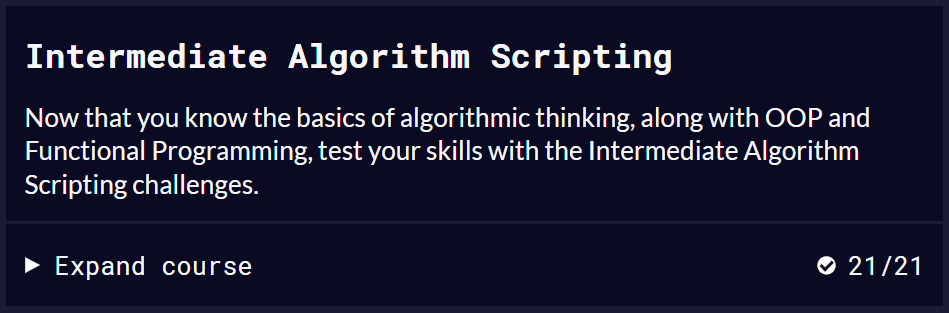

JavaScript Algorithms and Data Structures Projects

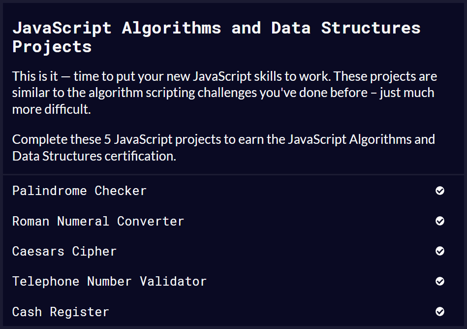

